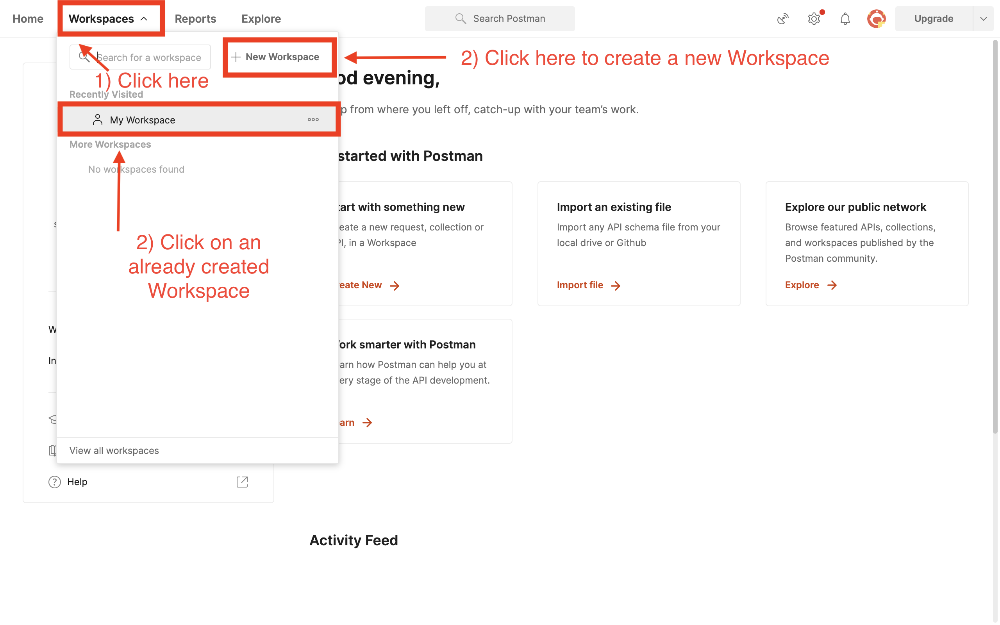
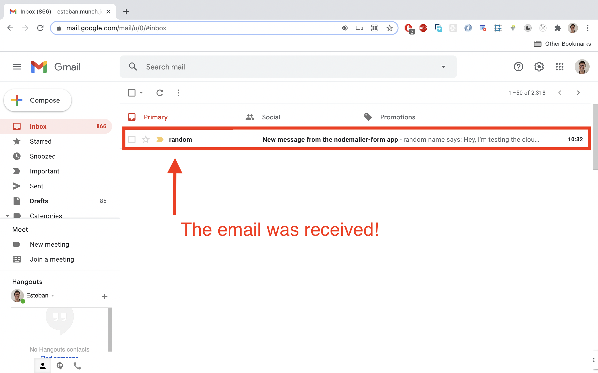
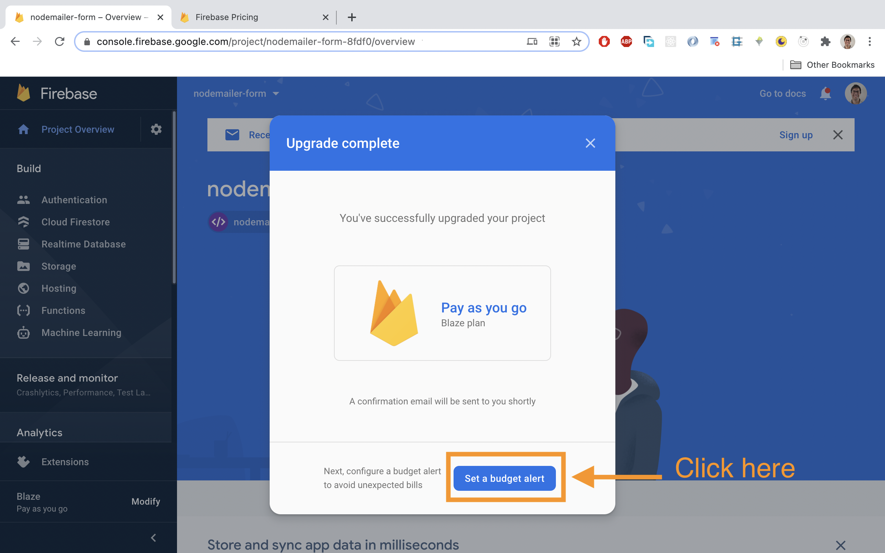
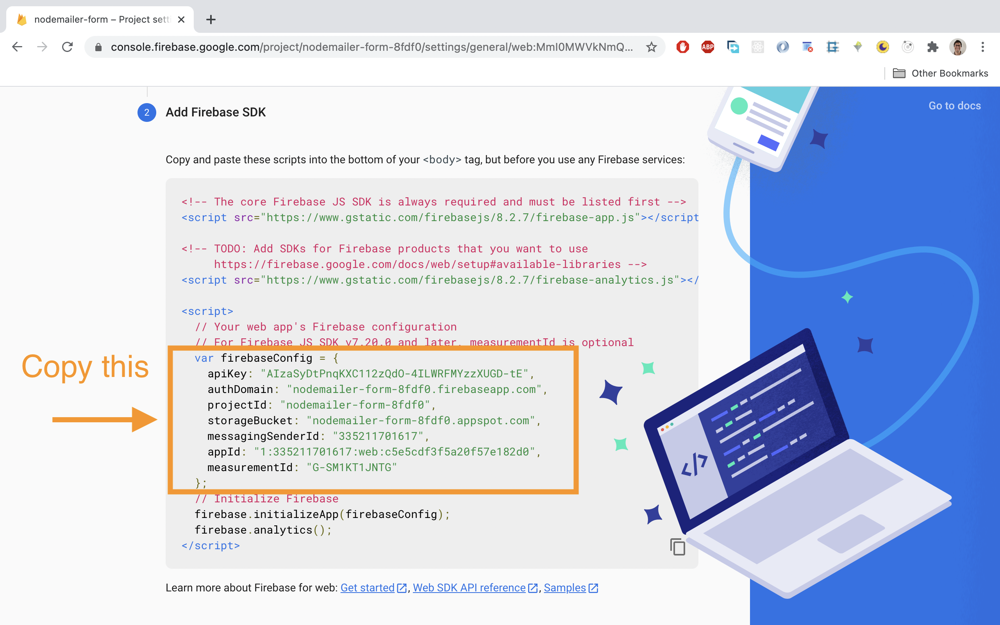

# React contact form with Nodemailer and cloud functions

Do you need to implement a **contact form in a React** app but **don't want create a back-end app to send an email?** Let's learn how to use a **serverless approach** with **[Cloud functions on Firebase](https://firebase.google.com/docs/functions)**, and an email service called **[Nodemailer](https://nodemailer.com/about/)** to make this task super easy! 

As a bonus, you'll get a React **full working form** with **validation**, with the awesome style of **[Material UI](https://material-ui.com/)** components. 

Check out the form functionality here 👉 [Open live app](https://nodemailer-form-8fdf0.web.app/). 

The GitHub repo of the form and the cloud function is here 👉 [Open GitHub repo](https://github.com/estebanmunchjones2019/nodemailer-form-app)

👉 Special thanks to [Sebastián Gallardo](https://www.linkedin.com/in/sebastian-gallardo-3aaba12b/) who wrote the cloud function of this article.


Table of contents:

* [Creating the contact form](#creating-the-contact-form)

* [Writing a cloud function for Firebase](#writing-a-cloud-function-for-firebase)
  * [What are they?](#what-are-they)
  * [Cloud function setup time!](#cloud-function-setup-time)
  * [Let's finally write the cloud function](#lets-finally-write-the-cloud-function)

* [Testing the cloud function running locally](#testing-the-cloud-function-running-locally)
  * [Starting a local emulator](#starting-a-local-emulator)
  * [Using Postman](#using-postman)
* [Deploying the cloud function](#deploying-the-cloud-function)
  * [Upgrading to a Blaze plan](#upgrading-to-a-blaze-plan)
  * [Let's finally deploy it!](#lets-finally-deploy-it)

* [Testing the deployed function on postman](#testing-the-deployed-function-on-postman)
* [Calling the cloud function from the React app](#calling-the-cloud-function-from-the-react-app)
  * [Registering the app on Firebase](#registering-the-app-on-firebase)
  * [Adding the Firebase SDK](#adding-the-firebase-sdk)
* [Testing the deployed function from inside the React App](#testing-the-deployed-function-from-inside-the-react-app)


**Note: if you wanna deploy a cloud function to the cloud, you'll need a credit card, altough you're not gonna be charged unless you invoke it more than 2 million times a month**


## Creating the contact form:

In this section we're gonna create a contact form with React, with the following features:

-Material UI components, to make it look good.

-Validation, to provide a better UX. The form can only be submitted if all the fields are not empty and the email address has the appropriate shape.

-Spinner, to show that something is on the way.

-Snackbars, to inform the user the result of an action.


So, let's get started and start building it:

1) **Create React app:**

Run these commands on the terminal to create new React app:

````bash
npx create-react-app nodemailer-form
cd nodemailer-form
````

2) **Add [Material UI](https://material-ui.com/):**

To install Material UI dependancies, run this:

````bash
npm install @material-ui/core
npm install @material-ui/lab
````

Please note that [react](https://www.npmjs.com/package/react) >= 16.8.0 and [react-dom](https://www.npmjs.com/package/react-dom) >= 16.8.0 are peer dependencies.

Material UI provides us with out of the box styled React components we can use straight away, and they implement [Material](https://material.io/design/introduction), a design system created by Google to help teams build high-quality digital experiences for Android, iOS, Flutter, and the web.

In other words, using Material UI is gonna give us an App-like look to our form.

3) **Add Roboto Font:**

Material-UI was designed with the [Roboto](https://fonts.google.com/specimen/Roboto) font in mind.

One way of adding it is via a CDN: 

````html
<!-- src/index.html -->

<link rel="stylesheet" href="https://fonts.googleapis.com/css?family=Roboto:300,400,500,700&display=swap" />
````

The above `<link>` tag must be added inside the `<head>` `</head>` tags.

Other way to install the font is via npm. You can learn how to do it [here](https://material-ui.com/components/typography/#general).

4) **Create the form** by pasting this code inside `src/App.js` file:

````javascript
//src/App.js

//import `useState` hook
import { useState } from 'react';

//import styles
import './App.css';

//import Material UI components and functions
import TextField from '@material-ui/core/TextField';
import Grid from '@material-ui/core/Grid';
import Button from '@material-ui/core/Button';
import Box from '@material-ui/core/Box';
import CircularProgress from '@material-ui/core/CircularProgress';
import Snackbar from '@material-ui/core/Snackbar';
import { Alert } from '@material-ui/lab'; 
import { makeStyles } from '@material-ui/core/styles';

//add CSS classes for Material UI components calling a function that returns another function
const useStyles = makeStyles((theme) => ({

  //the CSS class honeypot is added to the honeypot field later on, which is not displayed to users.
  honeypot: {
    display: 'none'
  }

}));  

function App() {

  //assign the constant `classes` to an object for Material IU components by calling a function
  const classes = useStyles();

  //define `error` state and the function to change it. The value is false by default
  const [error, setError] = useState(false); 

  //define `openSnackbar` state and the function to change it. The value is false by default
  const [openSnackbar, setOpenSnackbar] = useState(false);

  //define `isLoading` state and the function to change it. The value is false by default
  const [isLoading, setIsLoading] = useState(false); 

  //define `formIsValid` state and the function to change it. The value is false by default
  const [formIsValid, setFormIsValid] = useState(false); 

  //define `contacForm` state and the function to change it
  //the whole form is represented by an object, with nested objects inside that represent the input fields  
  const [contactForm, setContactForm] = useState({ 
    name: {
      value: '',
      elementConfig: {
        required: true,
        id: "standard-basic", 
        label: "Your Name",
        
      },
      validation: {
        required: true,
        errorMessage: 'Please, enter your name'
      },
      valid: false,
      blur: false
    },
  
    email: {
      value: '',
      elementConfig: {
        required: true,
        id: "standard-basic",
        label: "Your Email",
      },
      validation: {
        required: true,
        isEmail: true,
        errorMessage: 'Please, enter your email'
      },
      valid: false,
      blur: false
    },
  
    message: {
      value: '',
      elementConfig: {
        required: true,
        id: "standard-multiline-static",
        label: "Your Message",
        multiline: true,
        rows: 4,
      },
      validation: {
        required: true,
        errorMessage: 'Please, enter your message'
      },
      valid: false,
      blur: false
    },  
  
    //this honeypot field isn't rendered to the DOM, so users don't see it, but it fools bots that fill it automatically
    honeypot: { 
      value: '',
      elementConfig: {
        className: classes.honeypot,
        label: 'If you are a human, do not type anything here. I am here to fool bots', 
      },
      //This `validation` property is added just to avoid and error when running checkValidity();
      validation: {
      },
      //this input is valid by default so it doesn't prevent human users to click the `Send` button
      valid: true,
      blur: false
    } 
  }); 

//convert the `contactForm` object into an array
const formElementsArray = []; 
for (let key in contactForm) {
    formElementsArray.push({
        id: key,
      ...contactForm[key]
    })
}

//map the array to return an array of JSX elements    
const formElements = formElementsArray.map(element => {
  return (
    <Box key={element.id}>
      <TextField
      {...element.elementConfig}
      error={!element.valid && element.blur} 
      helperText={(!element.valid && element.blur) ? element.validation.errorMessage : null} 
      onChange={(event) => inputChangedHandler(event, element.id)}  
      onBlur={(event) => inputChangedHandler(event, element.id)}  
      value={element.value}  
      ></TextField>  
    </Box>  
  );
}); 

//this function runs when an input changes or is blurred
const inputChangedHandler = (event, inputIdentifier)  => {

  //create a new object representing the input that was changed or blurred
  const updatedFormElement = {
    ...contactForm[inputIdentifier],
    value: event.target.value,
    valid: checkValidity(event.target.value, contactForm[inputIdentifier].validation),
    blur: event.type == 'blur' ? true : false,
    touched: true
  } 
  
  //create a new object represeting the whole form object
  const updatedContactForm = {
    ...contactForm,
    [inputIdentifier]:  updatedFormElement
  }
  
  //the whole form is valid until it's not
  let formIsValid = true;
  for (let inputElementIdentifier in updatedContactForm) {
      formIsValid = updatedContactForm[inputElementIdentifier].valid && formIsValid;
  }

  //update `contactForm` state
  setContactForm(updatedContactForm);

  //update `formIsValid` state
  setFormIsValid(formIsValid)

} 

//this function is called from inside `inputChangedHandler()`, and checks the validity of an input field
const checkValidity = (value, rules) => {

  //it's always true until there's one false in the way
  let isValid = true; 
  if (rules.required) {
    //value.trim() gets rid of white spaces
    isValid = value.trim() !== '' && isValid; 
  }

  if (rules.isEmail) {
    //the `pattern` constant is a Regular Expression that matches the shape of an email
    const pattern = /[a-z0-9!#$%&'*+/=?^_`{|}~-]+(?:\.[a-z0-9!#$%&'*+/=?^_`{|}~-]+)*@(?:[a-z0-9](?:[a-z0-9-]*[a-z0-9])?\.)+[a-z0-9](?:[a-z0-9-]*[a-z0-9])?/;
    
    //`pattern.test()` returns true or false
    isValid = pattern.test(value) && isValid;
  }

  return isValid;

}

//this function is called when the user closes the snackbar after getting an error (when the cloud function fails)
const closeSnackbar = () => {
  setOpenSnackbar(false);
}

//this function is called when clicking the `Send` button
const submitForm = () => {

  //if a bot filled the honeypot field, don't keep running code (e.g don't call a cloud function)
  if (contactForm.honeypot.value != '') {
    //the below `return` is called an `early return` and it ends the execution of the function.
    return
  }

  //set `isLoading` state to true, so the spinner is rendered
  setIsLoading(true);

  //this fake cloud function consoles log the data from the form that is passed to it, and has a 50% chance of resolving.
  const fakeCloudFunction = (data) => {
    console.log(data);
    return new Promise((resolve, reject) => {
      const error = Math.random() > 0.5 ? true : false;
      setTimeout(() => {
        if (!error) {
          resolve();
        } else {
          reject();
        }
      },1000)
    });
  }

   //call the fake cloud function. Later on, this function will be replaced by the real cloud function.
   fakeCloudFunction({
    name: contactForm.name.value,
    email: contactForm.email.value,
    message: contactForm.message.value
  }).
  //the code inside the `then()` block runs when the message was successfully sent from inside the cloud function
  then(() => {

    //create a new `contactForm` object that looks like the original `contactForm` state
    let originalContactForm = {};
    for(let key in contactForm){
      originalContactForm[key] = {
        ...contactForm[key],
        value: '',
        valid: key == 'honeypot'? true : false,
        blur: false
      }
    }

    //reset `contactForm` state to its original value
    setContactForm(originalContactForm);

    //reset the whole form validity to false
    setFormIsValid(false);

    //set `error` state to false.
    setError(false);

    //set `isLoading` state to false, so the spinner is not rendered anymore
    setIsLoading(false);

    //set `openSnackbar` state to true, so the snackbar is rendered, with content that depends on the error state
    setOpenSnackbar(true);
  }).
  //this code below runs when the message was NOT successfully sent from inside of the cloud function
  catch(() => {

    //set `error` state to true
    setError(true);

    //set `isLoading` state to false, so the spinner is not rendered anymore
    setIsLoading(false);

    //set `openSnackbar` state to true, so the snackbar is rendered, with content that depends on the error state
    setOpenSnackbar(true);

  })

} 
  

//return what's rendered to the virtual DOM
  return (
    <Box mt="3rem">
      <Grid container justify="center">  
        <Box>
          <Grid container alignItems="center" direction="column">
            <h2>Send us a message</h2>
            <p>We'll get back to you soon.</p>
            <form> 
              {formElements}
              <Grid container justify="center">
                <Box mt="2rem">
                  {isLoading ? <CircularProgress /> : (
                  <Button
                  onClick={submitForm}
                  disabled={!formIsValid} 
                  variant="contained"
                  color="primary"
                  >Send</Button>)} 
                </Box>            
              </Grid>
            </form>
          </Grid>
        </Box>
    </Grid>
    {error ? <Snackbar 
      open={openSnackbar} 
      onClose={closeSnackbar}
      anchorOrigin={{ vertical: 'top', horizontal: 'center' }}
      >
        <Alert onClose={closeSnackbar} severity="error">
          Oops! Something went wrong, try again later.
        </Alert>
      </Snackbar> : 
      <Snackbar 
      open={openSnackbar} 
      autoHideDuration={2000} 
      onClose={closeSnackbar}
      anchorOrigin={{ vertical: 'top', horizontal: 'center' }}
      >
      <Alert severity="success">
        Message sent!
      </Alert>
    </Snackbar>}
  </Box>
   
  );
}
export default App;


````

The above code has a dummy implementation of cloud function called `fakeCloudFunction` , using a function with a `Promise` and a `setTimeout()`, but it's gonna be replaced in the comming sections with a real cloud function that actually sends and email with the data we provide in the form.

If you feel overwelmed by the length and complexity of the `App.js`  component containing the form, take a look a this Academind course: [React - The Complete Guide (incl Hooks, React Router, Redux)](https://pro.academind.com/p/react-the-complete-guide-incl-hooks-react-router-redux) and then you'll feel at home reading the code again. The form code was copied from there, and it's explained there step by step.

5) **Test the form:**

In order to test the form manually, run this command to serve the app:

````bash
npm start
````

and then open a tab in the browser and go to `localhost:3000` to see the form. Try clicking the fields and leave them empty, to see if validation works. Also try to add an invalid email address and see what happens.

6) **Test the honeypot:**

As we don't want our form to be filled and submitted by bots, there's a trap we've set up in the form, which is a form field that is not displayed to users, but that bots see, and fill it automatically. 

````javascript
//the honeypot form field

 honeypot: { 
      value: '',
      elementConfig: {
        className: classes.honeypot,
        label: 'If you are a human, do not type anything here. I am here to fool bots', 
      },
      validation: {
      },
      valid: true,
      blur: false
 } 
````

````javascript
//if the honeypot field was filled, the early return prevents the cloud function to be called

const submitForm = () => {
  if (contactForm.honeypot.value != '') {
    return
  }
  (...)
}
````

Then, we know that if the honeypot field was filled, that was a done by a bot, and we handle the submission of the form in a different way, by doing an early return and avoid calling the cloud function.

So, in order to test the honeypot, just change manually the `contactForm` state in `src/App.js` by swaping `contactForm.honeypot.value` from `''` to a number like `1` or a string like this one: `hey, I am bot who filled this form!`.

After doing the above change, you should still be able to click the `Send` button, but `fakeCloudFunction()` won't be called. You can verify that by looking at the `Console` on the dev tools on the browser. You shouldn't see the data logged from the form that is console logged from inside `fakeCloudFunction()`.


**Great!** We have a **form already working and manually tested!** Let's now replace the `fakeCloudFunction()` with the real one in the following sections.


## Writing a cloud function for Firebase

#### What are they?

**Cloud Functions for Firebase** is a **serverless framework** that lets you automatically run backend code in response to events triggered by Firebase features and HTTPS requests. 

Your JavaScript or TypeScript code is stored in Google's cloud and runs in a managed environment. There's no need to manage and scale your own servers.

To know more about them, read the [docs](https://firebase.google.com/docs/functions).

If you wanna know more about **serverless**, you can check out this Academind course: [AWS Serverless APIs & Apps - A Complete Introduction](https://pro.academind.com/p/aws-serverless-apis-apps-a-complete-introduction), which uses AWS instead of Firebase.


#### Cloud function setup time!

Follow these steps to write your first cloud function:

1) **Create a firebase project:**

In the [Firebase console](https://console.firebase.google.com/), click **Add project**, then select or enter a **Project name**. You could name it `nodemailer form`, but feel free to choose something different.

If you have trouble setting up the project, read this [docs](https://firebase.google.com/docs/functions/get-started).

2) **Install the Firebase CLI:**

Run the following on the your terminal:

````bash
npm install -g firebase-tools
````

This installs the globally available firebase command. If the command fails, you may need to [change npm permissions](https://docs.npmjs.com/getting-started/fixing-npm-permissions). 

3) **Initialize your project:**

   a) Run

````bash
firebase login
````

 to log in via the browser and authenticate the firebase tool.

  b) Initialize a firebase project by running:

```bash
firebase init
```

  c) You''ll be promted with this question:

````bash
? Which Firebase CLI features do you want to set up for this folder? Press Space to select features, then Enter to confirm your choic
es. (Press <space> to select, <a> to toggle all, <i> to invert selection)
❯◯ Database: Configure Firebase Realtime Database and deploy rules
 ◯ Firestore: Deploy rules and create indexes for Firestore
 ◯ Functions: Configure and deploy Cloud Functions
 ◯ Hosting: Configure and deploy Firebase Hosting sites
 ◯ Storage: Deploy Cloud Storage security rules
 ◯ Emulators: Set up local emulators for Firebase features
 ◯ Remote Config: Get, deploy, and rollback configurations for Remote Config
````

Let's choose this option:

````bash
 ❯◯ Functions: Configure and deploy Cloud Functions
````

  d) Then, youl'll be prompted with this:

````bash
=== Project Setup
First, let's associate this project directory with a Firebase project. You can create multiple project aliases by running firebase use --add, but for now we'll just set up a default project.

? Please select an option: (Use arrow keys)
❯ Use an existing project 
  Create a new project 
  Add Firebase to an existing Google Cloud Platform project 
  Don't set up a default project 
````

Choose this option:

````bash
❯ Use an existing project 
````

  e) We'll be asked which project and select the project you created on the step 1.

````bash
? Select a default Firebase project for this directory: 
❯ {your-project-name-xxxxx} ({your-project-name}) 
(...)
````

Where `your-project-name` depends on how you named your project. The `xxxxx` characters are chosen by Firebase automatically.

Then, we'll see this:

````bash
=== Functions Setup

A functions directory will be created in your project with a Node.js
package pre-configured. Functions can be deployed with firebase deploy.
? What language would you like to use to write Cloud Functions? (Use arrow keys)
❯ JavaScript 
  TypeScript 
````

Let's choose:

````bash
❯ JavaScript 
````

  f) We're now asked about ESLint:

````
? Do you want to use ESLint to catch probable bugs and enforce style? (y/N)
````

Let's choose:

````bash
N
````

to make this tutorial easier.

  g) At this point, some files have been created inside the new folder called `functions`:

````
✔  Wrote functions/package.json
✔  Wrote functions/index.js
✔  Wrote functions/.gitignore
? Do you want to install dependencies with npm now? (Y/n) 
````

We are asked about installing all the dependancies inside the `/functions` folder. Let's choose:

````bash
y
````

If all the set up process went well, we'll see this:

````bash
i  Writing configuration info to firebase.json...
i  Writing project information to .firebaserc...

✔  Firebase initialization complete!
````

  i) Lets install a couple more dependancies that we're gonna need in our cloud function, but first make sure to navigate to `/functions`  with your terminal:

````bash
cd functions
````

Now, check that you are currently at `your-react-project-name/functions` by looking at the terminal. If you're not sure, just check it by running:

````bash
pwd
````

Now that your are sure you're inside the right location, run this command to install `nodemailer` and `cors` modules:

````bash
npm i nodemailer cors
````


#### Let's finally write the cloud function

All the cloud functions we wanna use must be exported from `functions/index.js` file. As this project only has one function, let's define it and export it inside that file. 

As a note, when you have multiple functions, it's better to create different files for them, and import & export them inside `functions/index.js`.

To email is gonna be send using **[Nodemailer](https://nodemailer.com/about/)**, a module, that we've already installed, for Node.js applications to allow easy as cake email sending ;)

So, let's write and export the cloud function inside `functions/index.js`:

````javascript
//functions/index.js

//import needed modules
const functions = require('firebase-functions');
const nodemailer = require('nodemailer');

//when this cloud function is already deployed, change the origin to 'https://your-deployed-app-url
const cors = require('cors')({origin: true});

//create and config transporter
let transporter = nodemailer.createTransport({
    host: "your host",
    port: your-port-number,
    secure: true, // true for 465, false for other ports
    auth: {
        user: 'your@email',
        pass: 'your password.'
    }
});

//export the cloud function called `sendEmail`
exports.sendEmail = functions.https.onRequest((req, res) => {
    //for testing purposes
    console.log("from sendEmail function. The request object is:", JSON.stringify(req.body));

    //enable CORS using the `cors` express middleware.
    cors(req, res, () => {
        //get contact form data from the req and then assigned it to variables
        const email = req.body.data.email;
        const name = req.body.data.name;
        const message = req.body.data.message;

        //config the email message
        const mailOptions = {
            from: email,
            to: `your@email`,
            subject: 'New message from the nodemailer-form app',
            text:  `${name} says: ${message}`
        }

        //call the built in `sendMail` function and return different responses upon success and failure
        return transporter.sendMail(mailOptions, (error, info) => {
            if(error){
                return res.status(500).send({
                    data:
                    {
                        "status": 500,
                        "message": error.toString()
                    }})
                }
            
            return res.status(200).send( {
                data:
                {
                    "status": 200,
                    "message": "sent"
            }});
        });
    });    
});


````

We use the `cors()` middleware...but what's that for? It helps us managing which`URLs` requests can be sent to our cloud function from. In the development phase, the config below is used to let us call the function from any URL:

````javascript
const cors = require('cors')({origin: true});
````

The documentation for the **transporter configuration** can be checked [here](https://nodemailer.com/smtp/). In order to fill in the required fields, like `host`, `port` and `auth` , you need to go to your email provider and find them.

The documentation for the **email message configuration** can be checked [here](https://nodemailer.com/message/), where you can find all the options available.


**Congratulations**! You've just created your first cloud function!


## Testing the cloud function running locally

#### Starting a local emulator

The moment of truth has come: it's time to see if our cloud function works properly. Let's do it **locally with a local emulator**; run this in the terminal:

````bash
firebase emulators:start --only functions
````

After running the command above, we should be prompted with this:

````bash
✔  functions[sendEmail]: http function initialized (http://localhost:5001/{your-project-name}/{server-location}/sendEmail).
````

where `your-project-name` and `server-location` depends on how you set up the Firebase project at the step 1 of [Cloud function setup time!](#cloud-function-setup-time) section.

To know know more about the local emulator, read these [docs.](https://firebase.google.com/docs/functions/local-emulator)


#### Using Postman

To test the cloud function already running locally on `http://localhost:5001/{your-project-name}/{server-location}/sendEmail` , we're gonna open [Postman](https://www.postman.com/), which is a software that let us call endpoints and test them individually. You can download it [here](https://www.postman.com/downloads/).

Follow these steps to test the cloud function:




It seems that the cloud function sent the email successfully. Now, go to your email provider inbox and check if you got the email sent with the function:




**Excellent!** you have successfully tested your cloud function running locally.

Now, it's time to deploy it to the cloud!


## Deploying the cloud function

The first step to deploy the cloud function to the cloud is changing the plan linked to the Firebase project to **Blaze, which is a pay as you plan**, but it has generous free quotas, e.g 2M invocations a month to cloud functions, **for free!**.

You can check the free quotas and pricing [here](https://firebase.google.com/pricing?authuser=0).

There's no way to disable the cloud function automatically if it is abused by someone hitting it thousands of times, but we can set up a budget alert so we're notified by email when we're are already charged a certain ammount by Google .

#### Upgrading to a Blaze plan

Follow these instructions to change the plan and set up a budget alert:





#### Let's finally deploy it! 

To finally deploy the cloud function to the cloud, run the following command:

````bash
firebase deploy --only functions
````

Then, we'll see this:

`````bash
=== Deploying to 'your-project-name'...

i  deploying functions
i  functions: ensuring required API cloudfunctions.googleapis.com is enabled...
i  functions: ensuring required API cloudbuild.googleapis.com is enabled...
✔  functions: required API cloudbuild.googleapis.com is enabled
✔  functions: required API cloudfunctions.googleapis.com is enabled
i  functions: preparing functions directory for uploading...
i  functions: packaged functions (21.64 KB) for uploading
✔  functions: functions folder uploaded successfully
i  functions: creating Node.js 12 function sendEmail({server-location})...
✔  functions[sendEmail({server-location})]: Successful create operation. 
Function URL (sendEmail): https://{server-location}-{your-project-name-xxxxx}.cloudfunctions.net/sendEmail

✔  Deploy complete!
`````

**Amazing!** We are now ready to test it with Postman again!


## Testing the deployed function on postman

This test is the same as we did [Using Postman](#using-postman) section, but making the request to this url instead: `https://{server-location}-{your-project-name-xxxx}.cloudfunctions.net/sendEmail`. 

For example, if your project name is `nodemailer-form-akfhs` and the server is `us-central1`, then the url would be: `https://us-central1-nodemailer-form-akfhs.cloudfunctions.net/sendEmail`.

You should see a successfull response on Postman, and a new email in your inbox, if everything went well.


##  Calling the cloud function from the React app

Now it's time to call the cloud function from inside our React app and get rid off the `fakeCloudFunction`.

We could just make an http POST request to `https://{server-location}-{your-project-name-xxxxx}.cloudfunctions.net/sendEmail`, but there's a better way: we can use the Firebase SDK that allows us to interact with different Firebase services, like cloud functions, from inside our app in an easy way.

#### Registering the app on Firebase

The first step towards adding the SDK is registering an app and copy the `firebaseConfig`:





#### Adding the Firebase SDK

We're gonna add the Firebase SDK via npm to our project. 

Open the terminal **at the root of your project**, and run this command:

````bash
npm i firebase
````

This command will install the firebase module inside the `node_modules` folder at the root level of our project, but not inside `functions/node_modules`.

Now, create a `src/firebase.js` (or any name you like) file and paste this:

````javascript
//src/firebase.js

//Import firebase from node_modules
import firebase from 'firebase';

//you have copy and paste this config from your Firebase Console
const firebaseConfig = {
    apiKey: "{your-apiKey}",
    authDomain: "{your-authDomain}",
    projectId: "{your-projectId}",
    storageBucket: "{your-storageBucket}",
    messagingSenderId: "{your-messagingSenderId}",
    appId: "{your-appId}",
    measurementId: "{your-measurementId}"
};

//initialize a Firebase instance
firebase.initializeApp(firebaseConfig);

//initialize Cloud Functions through Firebase
firebase.functions();

//this is optional, in case you want you wanna use analytics
firebase.analytics();

//export the `firebase` namespace to import it in src/App.js
export default firebase;
````


Let's know make the following changes to `src/App.js`:

````javascript
//src/App.js

//add this import at the top of the file
import firebase from './firebase';

//add this to assign the sendEmail cloud function to a constant
const sendEmail = firebase.functions().httpsCallable('sendEmail');

//inside function App()
function App() {
  //inside submitForm()
  const submitForm = () => {
  //replace fakeCloudFunction with sendEmail
  sendEmail({
    name: contactForm.name.value,
    email: contactForm.email.value,
    message: contactForm.message.value
  }).
  then(() => {
  	(...)  
  })
  .catch(() => {
    (...)
  })
}


````

We use the `httpCallable()` method to directly point to a specific cloud function, by simply passing the name of the cloud function, which is `sendEmail` in this case.

The **`httpCallable()`** method **can only be used when the cloud function was defined with `functions.http()` backend API**, which is true in our case (you can check `functions/index.js` to verify that we used it).

**That's it!** This is all the setup needed to finally call the cloud function from inside the React app.

Let's now test it.


## Testing the deployed function from inside the React App

Let's serve the app in development by running:

````bash
npm start
````

and open the browser on `localhost:3000`.

Now, fill in the form and submit it. The `snackbars` should tell you if the request was successful or not. If you wanna be really sure, open your browser dev tools, go to network, and check the response body of the request.

To complete the test, go to your email inbox, and verify you got the the email.

Optionally, you could also deploy your React app to Firebase, following this [steps](https://firebase.google.com/docs/hosting/quickstart). 

As a final step, you can change the setup of the `cors` middleware of the cloud function by adding to the whitelist the `URL` of your deployed app.

````javascript
//functions/index.js

const cors = require('cors')({origin: "{your-deployed-app-URL}"});
````

This way, requests on the browser can only be done from your deployed app and not from other URLs.

If you redeploy your cloud function after changing the `cors` config, and you run your app locally on `localhost:3000`, you should see the following error on the console on your browser dev tools when submiting the form:

````bash
Access to fetch at 'https://us-central1-nodemailer-form-8fdf0.cloudfunctions.net/sendEmail' from origin 'http://localhost:3000' has been blocked by CORS policy: Response to preflight request doesn't pass access control check: No 'Access-Control-Allow-Origin' header is present on the requested resource. If an opaque response serves your needs, set the request's mode to 'no-cors' to fetch the resource with CORS disabled.
````

But, if you filll in the form from your deployed app URL, you shouldn't see any error related to CORS. This would prove that the `cors` config change was successfully done.


**That was all!** It was a long tutorial, but now, you can feel more confident and apply this for a contact form in your next project! 

**Happy coding!**

